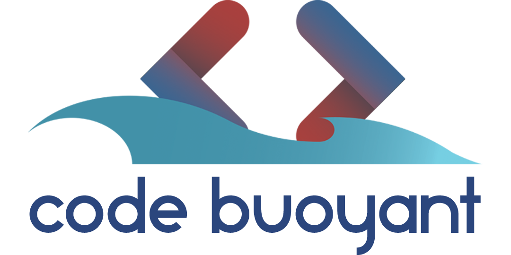

 

<h2 align="center" style="color:#2b467d">👋 Hi there! We're Code Buoyant</h2>

  <a style="color:#F34226" href="https://codebuoyant.com">Website</a> •
  <a style="color:#F34226" href="https://twitter.com/CodeBuoyant">Twitter</a> •
  <a style="color:#F34226" href="https://instagram.com/codebuoyant">Instagram</a> •
  <a style="color:#F34226" href="https://www.linkedin.com/company/codebuoyant">Linkedin</a>

---

Code Buoyant is a group of experienced and passionate persons who has expertise in designing, development, management, writing, and many other aspects related to the information technology field. Every project we work on, we think of it as our own. Our clients are our family and we are happy to face any challenges to provide the best services to our clients.

---

- 💬 **Ask us about:** PHP, JavaScript, Laravel, ReactJS, CodeIgniter, Bootstrap, CSS, SASS, TailwindCSS, MySQL
- **How to reach us:** [@CodeBuoyant](https://twitter.com/CodeBuoyant)